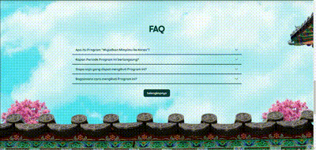

# HelloCode Fullstack Interview 2024

## Prerequisite

- Node.js
- NPM

## Installation

1. Go to `fullstack-interview-august-2024` directory
2. Install the dependencies using `npm install`
3. Run development server using `npm run dev`
4. Open your browser and go to http://127.0.0.1:51423

## Task

- [ ] **Dream** section
  - [ ] Must be responsive on desktop & mobile version
  - [ ] Height & width must be 100% of the screen
- [ ] **Instagram posts** section
  - [ ] Must be responsive on desktop & mobile version
  - [ ] Height & width must be 100% of the screen
- [ ] **Steps** section
  - [ ] Must be responsive on desktop & mobile version
  - [ ] Height & width must be 100% of the screen
- [ ] **FAQ** section
  - [ ] Must be responsive on desktop & mobile version
  - [ ] If the **Read more** button is clicked, 10 other questions will appear

## Note

- Desktop & mobile versions must be in the same `index.html` file
- All images you need are available in `assets` directory
- Use `tw-` prefix for Tailwind's classes to prevent conflicts with Bootstrap classes
- The `assets/plane.mobile.webp` image only used in mobile version
- You can use lorem ipsum text for FAQ question & answer
- Image with `.desktop.webp` suffix used only on desktop version (greater or equal than tailwind medium screen `md:`)
- Image with `.mobile.webp` suffix used only on mobile version

> [!TIP]
>
>- You don't need to write any javascript code at all
>- Use Bootstrap accordion & collapse for FAQ & Read more button
>- Use `picture`, `source` & `img` HTML elements to use image with desktop & mobile versions
>- Desktop & mobile version can be implemented in the same HTML element without writing it multiple times

## Submission

The deadline is **1 September 2024 at 17.00**. The faster you finish, the greater your chances to join us.

> [!TIP]
> Generally clients expect a page like this to be done in 2 - 3 working days.

> [!IMPORTANT]   
> Development speed & accuracy to the design are the key points above the other factors.

Push your work to your private github repository and make sure to allow access for these github accounts:

- [lamualfa](https://github.com/lamualfa)
- [fajarmochamadiksan](https://github.com/fajarmochamadiksan)

After that we will inform you via email no later than **3 September 2024 at 17.00**.

Thanks and good luck 🌟.

## References

> [!CAUTION]
> Below are the designs for our real clients. It is prohibited to distribute it for any reason.

### Desktop design

### Mobile design

### FAQ read more button

